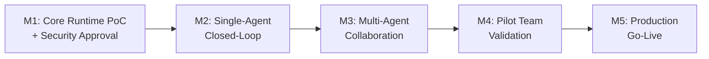

# Example: AI Agent Platform

This example demonstrates a complete input → output flow for building an
AI Agent platform project.

## Input

### Project Requirements Summary

**Project**: Build an internal AI Agent Platform

**Goal**: Enable internal teams to build, deploy, and monitor AI agents that
can execute multi-step tasks across company tools (Jira, Slack, GitHub, internal
APIs).

**Key Requirements**:
- Agents can call multiple tools in a single session
- Multi-agent collaboration (one agent hands off to another)
- Observability dashboard for agent runs
- Role-based access control (RBAC)
- Integration with at least 5 internal tools at launch

**Constraints**:
- 6-month timeline
- Team of 8 engineers
- Must pass security review before any production data access

### Task Breakdown (Partial)

The team initially proposed these "milestones":
1. Frontend scaffolding
2. Backend API development
3. Agent runtime engine
4. Tool integration framework
5. Multi-agent orchestration
6. Observability pipeline
7. RBAC implementation
8. Testing
9. Deployment

---

## Output (Milestone Builder Result)

# Milestone Plan: AI Agent Platform

## 1. Project Success Definition

Internal teams can independently build and deploy AI agents that execute
multi-step workflows across company tools, with full observability and
access control, within a self-service platform.

## 2. Risk Assessment

### Top Risks (Ranked)

| # | Risk | Category | Likelihood | Impact | Addressed By |
|---|------|----------|------------|--------|--------------|
| 1 | Agent runtime cannot meet latency SLA with multi-tool calls | Technical | High | High | M1 |
| 2 | Security review blocks production data access | Business | Medium | Critical | M1 |
| 3 | Multi-agent handoff is unreliable (context loss, race conditions) | Technical | Medium | High | M3 |
| 4 | Internal tool APIs change or are unstable | Integration | Medium | Medium | M2 |
| 5 | Teams don't adopt the platform (too complex, no clear value) | Business | Medium | High | M4 |

## 3. Milestone Overview

| M# | Name | Category | Eliminates Risk | Validates |
|----|------|----------|-----------------|-----------|
| M1 | Core Runtime PoC + Security Pre-Approval | Risk Gate | #1, #2 | Agent runtime feasible; security path clear |
| M2 | Single-Agent Closed-Loop with 5 Tools | Capability Gate | #4 | End-to-end agent capability with real tools |
| M3 | Multi-Agent Collaboration Closed-Loop | Integration Gate | #3 | Architecture scalable to multi-agent patterns |
| M4 | Pilot Team Validation | Validation Gate | #5 | Real teams find the platform usable and valuable |
| M5 | Production Go-Live | Production Gate | — | Platform is secure, observable, and reliable |

## 4. Detailed Milestones

### M1: Core Runtime PoC + Security Pre-Approval
- **Category**: Risk Gate
- **Risk Eliminated**: Agent runtime latency feasibility (#1), Security approval path (#2)
- **Value Validated**: The core technology choice is viable; security requirements are known and achievable

**Exit Criteria** (binary):
1. Agent runtime completes a 3-tool sequential call in <5 seconds end-to-end
2. Security team has reviewed architecture and provided written approval to proceed with production data access plan

**Checklist**:
- [ ] Prototype agent runtime with tool-calling loop (max 3 tools)
- [ ] Measure and document latency for single-tool and multi-tool scenarios
- [ ] Draft security architecture document covering data access, isolation, and audit
- [ ] Schedule and complete security architecture review meeting
- [ ] Document any security requirements that must be met before production access

**Evidence Required**:
1. Benchmark report — Latency measurements for 1-tool, 2-tool, and 3-tool calls
2. Document — Security architecture document with security team sign-off
3. Document — List of security requirements for production access

### M2: Single-Agent Closed-Loop with 5 Tools
- **Category**: Capability Gate
- **Risk Eliminated**: Tool API instability (#4 — validated by integration)
- **Value Validated**: A single agent can complete a real business task using production tools

**Exit Criteria** (binary):
1. Agent successfully completes 10 predefined test scenarios, each using 2+ tools
2. All 5 tool integrations pass contract tests against live sandbox environments

**Checklist**:
- [ ] Build tool integration framework with standardized tool definition spec
- [ ] Integrate 5 tools: Jira, Slack, GitHub, Confluence, internal API gateway
- [ ] Implement tool execution sandbox with timeout and error handling
- [ ] Create 10 test scenarios covering common team workflows
- [ ] Run automated contract test suite against sandbox environments
- [ ] Document tool integration guide for future tool additions

**Evidence Required**:
1. Test report — 10/10 scenarios passing with success rate and latency data
2. Dashboard screenshot — Agent run trace showing multi-tool execution
3. Document — Tool integration guide

### M3: Multi-Agent Collaboration Closed-Loop
- **Category**: Integration Gate
- **Risk Eliminated**: Multi-agent handoff unreliability (#3)
- **Value Validated**: Complex workflows can be decomposed across specialized agents

**Exit Criteria** (binary):
1. Multi-agent handoff completes with <1% context loss rate across 100 test runs
2. 3-agent collaboration completes a complex workflow (create Jira ticket → review code in GitHub → post summary in Slack)

**Checklist**:
- [ ] Implement agent-to-agent handoff protocol with context serialization
- [ ] Build agent router/dispatcher for intent-based agent selection
- [ ] Implement conflict detection for overlapping tool calls
- [ ] Create 3-agent collaboration test scenario
- [ ] Run 100-iteration reliability test for handoff consistency

**Evidence Required**:
1. Test report — 100-run reliability benchmark with context loss metrics
2. Demo video or link — 3-agent collaboration completing the cross-tool workflow
3. Architecture doc update — Multi-agent protocol specification

### M4: Pilot Team Validation
- **Category**: Validation Gate
- **Risk Eliminated**: Low platform adoption (#5)
- **Value Validated**: Real teams can independently build useful agents

**Exit Criteria** (binary):
1. 3 pilot teams each build and deploy at least 1 agent
2. Pilot team satisfaction survey scores >4/5 on usability and value

**Checklist**:
- [ ] Recruit 3 pilot teams from different departments
- [ ] Create onboarding documentation and 2 tutorial videos
- [ ] Run onboarding workshop for each pilot team
- [ ] Provide office-hours support during 2-week pilot period
- [ ] Collect and analyze usage metrics and satisfaction surveys
- [ ] Document top 5 improvement requests from pilot feedback

**Evidence Required**:
1. Data — Usage metrics dashboard (agents created, runs completed, tools called)
2. Document — Survey results summary with team feedback
3. Document — Prioritized improvement backlog

### M5: Production Go-Live
- **Category**: Production Gate
- **Risk Eliminated**: Operational risk (no monitoring, no rollback plan)
- **Value Validated**: Platform is secure, observable, and reliable in production

**Exit Criteria** (binary):
1. All security requirements from M1 are implemented and verified
2. Platform available to all internal teams with <1 hour downtime in first week

**Checklist**:
- [ ] Implement RBAC with role definitions for admin, builder, and viewer
- [ ] Set up monitoring dashboards (latency, error rate, tool call success rate)
- [ ] Configure alerting for critical paths (agent runtime down, tool timeout spike)
- [ ] Write and review operational runbooks
- [ ] Run load test simulating 50 concurrent agents
- [ ] Execute production deployment with canary rollout
- [ ] Announce platform availability to all engineering teams

**Evidence Required**:
1. Dashboard — Production monitoring dashboard with 7-day stability metrics
2. Document — Signed-off runbooks and incident response plan
3. Document — Load test report with capacity recommendations

## 5. Execution Path

Timeline: ~6 weeks per milestone with parallel work on non-blocking tasks.
