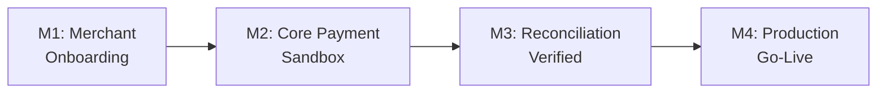

# Example: Payment Gateway Integration

This example demonstrates a complete input → output flow for integrating
a new payment channel.

## Input

### Project Requirements Summary

**Project**: Integrate WeChat Pay as a new payment channel

**Goal**: Enable customers to pay using WeChat Pay on the e-commerce platform,
covering the full flow from checkout → payment → confirmation → refund.

**Key Requirements**:
- Support one-time payments and refunds
- Handle WeChat Pay's asynchronous callback mechanism
- Pass PCI-DSS compliance review for the new channel
- Update order management system to track WeChat Pay transactions
- Support reconciliation with WeChat Pay settlement files

**Constraints**:
- 3-month timeline (WeChat Pay partnership agreement deadline)
- Must go live in time for Q4 promotion
- WeChat Pay merchant onboarding is external and timeline is uncertain

### Original Task Breakdown

1. API integration development
2. Database schema changes
3. Frontend checkout update
4. Reconciliation system
5. Testing
6. Deployment

---

## Output (Milestone Builder Result)

# Milestone Plan: WeChat Pay Integration

## 1. Project Success Definition

Customers can select WeChat Pay at checkout, complete payment, and receive
order confirmation — with full support for refunds and daily reconciliation —
in time for the Q4 promotional period.

## 2. Risk Assessment

### Top Risks (Ranked)

| # | Risk | Category | Likelihood | Impact | Addressed By |
|---|------|----------|------------|--------|--------------|
| 1 | WeChat Pay merchant onboarding delayed or rejected | Business | Medium | Critical | M1 |
| 2 | Asynchronous callback handling causes data inconsistency (double charge, lost payment) | Technical | Medium | Critical | M2 |
| 3 | PCI-DSS compliance review blocks production deployment | Business | Low | High | M2 |
| 4 | WeChat Pay API behavior differs from documentation | Integration | Medium | Medium | M2 |
| 5 | Settlement file reconciliation fails under peak transaction volume | Technical | Low | Medium | M3 |

## 3. Milestone Overview

| M# | Name | Category | Eliminates Risk | Validates |
|----|------|----------|-----------------|-----------|
| M1 | WeChat Pay Merchant Onboarding Approved | Risk Gate | #1 | Payment channel is legally and contractually viable |
| M2 | Core Payment Flow Closed-Loop in Sandbox | Capability Gate | #2, #3, #4 | Payment, callback, and refund flow works correctly |
| M3 | Reconciliation and Operations Verified | Integration Gate | #5 | Financial data integrity under load |
| M4 | Production Go-Live | Production Gate | — | Platform is live with real transactions |

## 4. Detailed Milestones

### M1: WeChat Pay Merchant Onboarding Approved
- **Category**: Risk Gate
- **Risk Eliminated**: Merchant onboarding delay/rejection (#1)
- **Value Validated**: The payment channel is contractually viable — the project is worth investing in

**Exit Criteria** (binary):
1. WeChat Pay merchant account is active with production API credentials issued
2. Contract signed by both parties

**Checklist**:
- [ ] Prepare and submit merchant application with required business documents
- [ ] Complete WeChat Pay compliance questionnaire
- [ ] Obtain test environment (sandbox) credentials
- [ ] Confirm settlement currency, fee structure, and payout schedule in writing
- [ ] Legal review and sign merchant agreement

**Evidence Required**:
1. Document — Signed merchant agreement
2. Credential — Production API key issued (confirm existence, don't share value)
3. Email — WeChat Pay onboarding confirmation email

### M2: Core Payment Flow Closed-Loop in Sandbox
- **Category**: Capability Gate
- **Risk Eliminated**: Callback data inconsistency (#2), PCI-DSS blocker (#3), API behavior mismatch (#4)
- **Value Validated**: The full payment lifecycle works — pay, confirm, refund

**Exit Criteria** (binary):
1. 100 test transactions (pay → callback → confirm) complete with zero data inconsistencies
2. PCI-DSS self-assessment questionnaire (SAQ) completed and submitted

**Checklist**:
- [ ] Implement WeChat Pay API client (unified order, query, refund, callback)
- [ ] Design and implement idempotency mechanism for callback processing
- [ ] Implement payment state machine (pending → paid → refunded) in order system
- [ ] Add WeChat Pay option to checkout UI with QR code / redirect flow
- [ ] Write and run 100-transaction integration test suite in sandbox
- [ ] Complete PCI-DSS SAQ for the new payment channel
- [ ] Verify refund flow: full refund, partial refund, and refund idempotency

**Evidence Required**:
1. Test report — 100/100 sandbox transactions with zero data inconsistencies
2. Document — Completed PCI-DSS SAQ with submission confirmation
3. Dashboard screenshot — Payment state machine transitions for all transaction types

### M3: Reconciliation and Operations Verified
- **Category**: Integration Gate
- **Risk Eliminated**: Settlement reconciliation failure at scale (#5)
- **Value Validated**: Financial operations team can reconcile WeChat Pay transactions daily

**Exit Criteria** (binary):
1. Reconciliation script processes 10,000 simulated transactions and matches 100% to settlement file
2. Operations team signs off on reconciliation runbook

**Checklist**:
- [ ] Implement settlement file parser (WeChat Pay daily settlement CSV)
- [ ] Build automated reconciliation pipeline (fetch file → parse → match → flag discrepancies)
- [ ] Generate reconciliation report with matched, unmatched, and adjustment line items
- [ ] Run load test with 10,000 simulated transactions
- [ ] Write reconciliation runbook for finance operations team
- [ ] Train operations team and collect sign-off

**Evidence Required**:
1. Test report — 10,000-transaction reconciliation with 100% match rate
2. Document — Signed-off reconciliation runbook
3. Document — Operations team training completion confirmation

### M4: Production Go-Live
- **Category**: Production Gate
- **Risk Eliminated**: Operational risk (no monitoring, no rollback)
- **Value Validated**: Real customers can pay with WeChat Pay

**Exit Criteria** (binary):
1. First 100 real customer transactions complete with zero errors in first 24 hours
2. Daily reconciliation report generated successfully for first 3 business days

**Checklist**:
- [ ] Configure production API credentials and whitelist production IPs
- [ ] Set up monitoring and alerting for WeChat Pay transaction success rate
- [ ] Set up alerting for reconciliation failures and settlement delays
- [ ] Write production rollback plan (switch off WeChat Pay at checkout)
- [ ] Execute canary deployment: enable WeChat Pay for 1% of users
- [ ] Ramp to 100% after 48 hours of clean metrics
- [ ] Verify first 3 daily reconciliation reports

**Evidence Required**:
1. Dashboard — 7-day production transaction metrics (volume, success rate, latency)
2. Document — 3 daily reconciliation reports with zero unexplained discrepancies
3. Document — Executed production deployment checklist with timestamps

## 5. Execution Path

Critical path note: M1 is on the external party's timeline. All development
work for M2 can begin in parallel using sandbox credentials obtained during
M1. If M1 is delayed by more than 2 weeks, escalate to leadership immediately
— this is the project's bottleneck.
